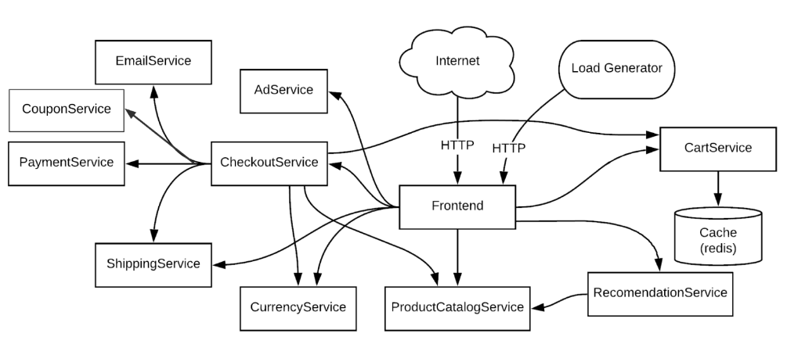
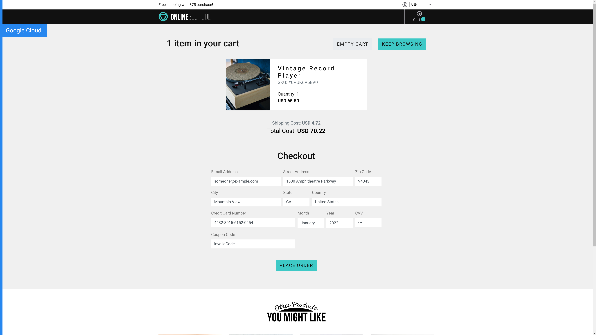
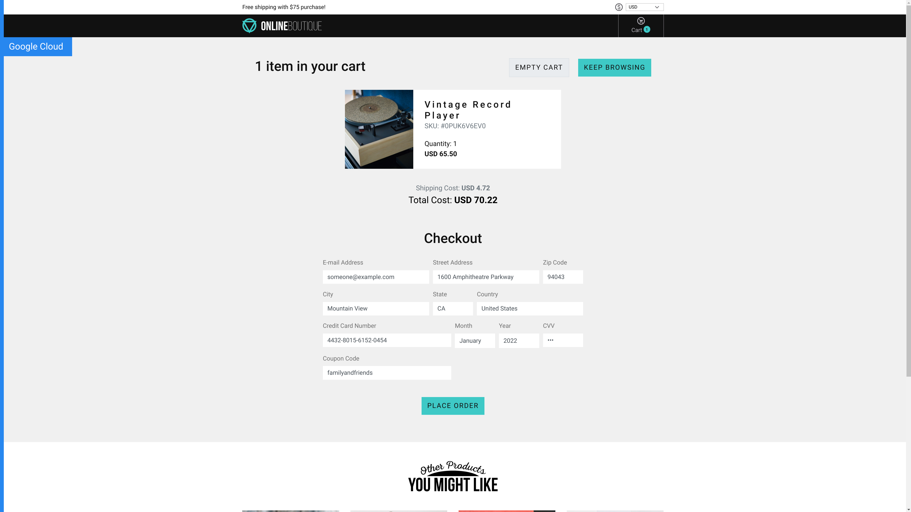
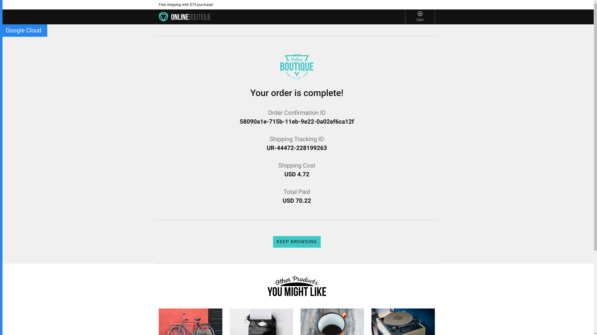
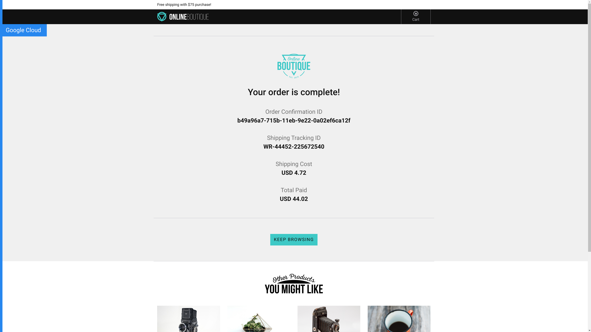

# CouponService
A Coupon Microservice that extends Google's Online Boutique Microservices Demo. This Microservice enables the customers to redeem coupons (discount codes) during checkout and get discounts on their purchases.


## Design
**CouponService** has been designed to be a very minimal Microservice. It receives the requests from **CheckoutService**, validates it by checking whether the queried code can be found in its in-memory database (populated with entries from *coupons.csv*) and responds with the discount in percentage. If the coupon is invalid, the discount will be 0 percents, and if its valid it will be in range (0,100]. 

The actual discount is then applied in **CheckoutService** internally and the new prices will be reflected in all other Services (e.g. **PaymentService**, **EmailService**) that process the order.

## Configuration
In order to change the list of valid discount codes, please edit the *coupons.csv* file.

In order to change the port of the service, please change the variable PORT in Dockerfile

## Running standalone
This Service is meant to be run with other Services, in particular at least with the **CheckoutService**. In order to run standalone:
```
docker build . -t couponservice
docker run couponservice
```

## Running with other services
For running with other services, please follow the local deployment quickstart instructions in [microservices repo](https://github.com/bobbsley/microservices-demo). 




## Screenshots


| Invalid coupon code                                                                                               | Valid coupon code with 40% discount                                                                                                |
| ----------------------------------------------------------------------------------------------------------------- | ------------------------------------------------------------------------------------------------------------------ |
| [](./img/invalid_checkout.png) | [](./img/valid_checkout.png) |
| [](./img/invalid_complete.png) | [](./img/valid_complete.png) |
